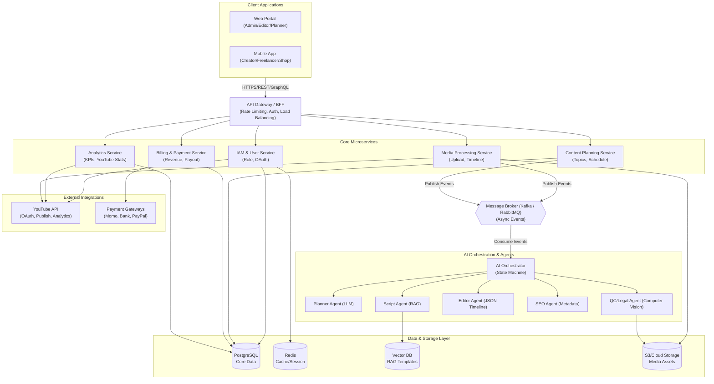
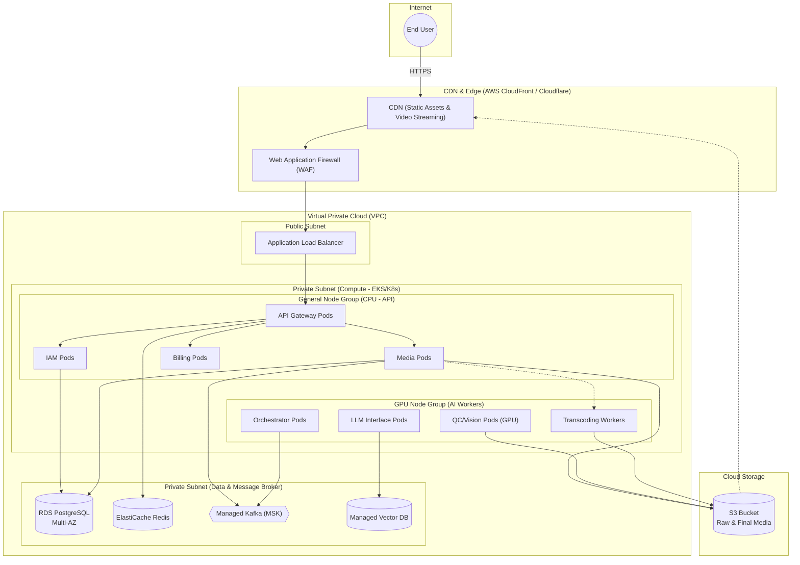
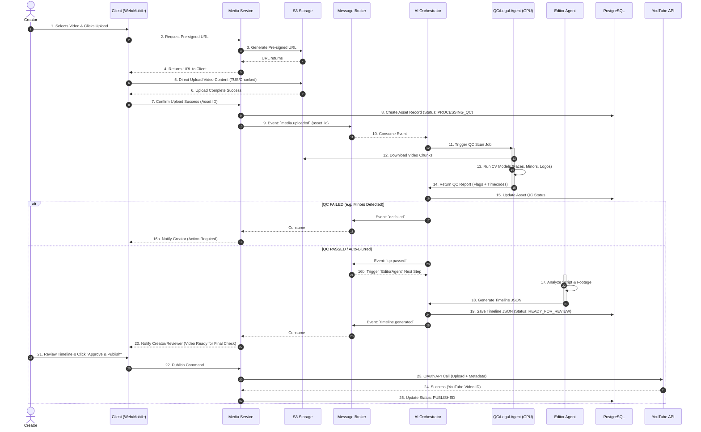

# Detailed System Architecture Diagrams

Dựa trên tài liệu `System_Design.md`, dưới đây là các biểu đồ thiết kế hệ thống chi tiết (Logical, Physical) và Luồng xử lý công việc (Workflow) sử dụng Mermaid.

## 1. Logical Architecture (Kiến trúc Logic)
Biểu đồ này thể hiện sự phân tách các module phần mềm, dịch vụ và cách chúng giao tiếp với nhau ở mức logic.

---

## 2. Physical / Deployment Architecture (Kiến trúc Vật lý)
Biểu đồ này thể hiện cách hệ thống được triển khai trên hạ tầng Cloud (ví dụ AWS/GCP), tập trung vào Containerization và Scaling.

---

## 3. Detailed Component Worflow (Luồng Xử lý Dữ liệu Chi tiết)

Dưới đây là Sequence Diagram mô tả một luồng xử lý phức tạp nhất: **Creator Upload Video -> AI QC -> Auto Edit -> Publish**.

