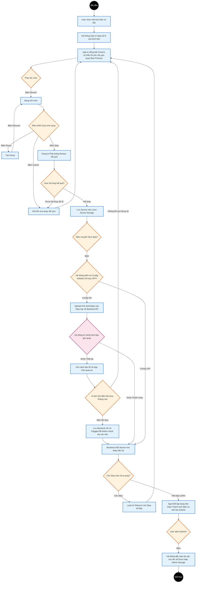

# Activity Diagram: Guided Camera Workflow

Biểu đồ Activity dưới đây (dưới dạng Mermaid UML) mô tả chi tiết luồng User thực hiện việc quay video, lưu trữ thiết bị, upload để AI xác thực, và hoàn thiện một kịch bản trên ứng dụng Mobile App (End-User) theo định nghĩa của MVP V1.

### Thuyết minh quy trình
1. **Camera Controls**: Biểu đồ miêu tả rõ vòng lặp Record -> Pause/Stop/Cancel, giúp user hoàn toàn kiểm soát đoạn video thô ngay cục bộ trước khi quyết định review.
2. **Lưu Local**: App chỉ tiến hành lưu vào Local Device sau khi người dùng hài lòng với đoạn video/hình ảnh vừa quay (`SaveLocal`).
3. **Chốt chặn AI Verify (Async và Bypass)**: Phụ thuộc vào cấu hình User (ON/OFF). Nếu ON, luồng Upload sẽ chạy ngầm không khoá màn hình chờ. Nếu Verify sai, App báo lỗi, User có thể chọn Kháng Cáo (Bypass) để đi thẳng thay vì bị kẹt lại vô lý (Tránh lỗi AI đánh nhầm False Positive).
4. **Final Submit và Cleanup**: Sau khi các Step kết thúc, trạng thái Ready for Submit được kích hoạt qua phương thức Chunked Upload (Thanh Progress bar). Sau khi đẩy Storage thành công 100%, Device sẽ bung popup hỏi giải phóng lưu trữ cục bộ để tránh rác dung lượng cho User.
