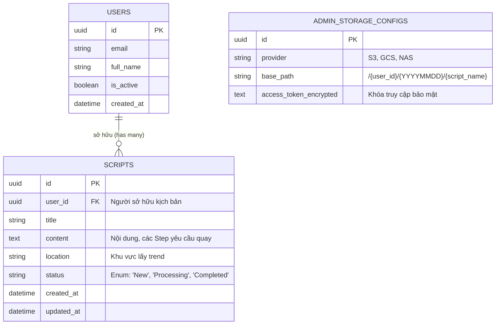
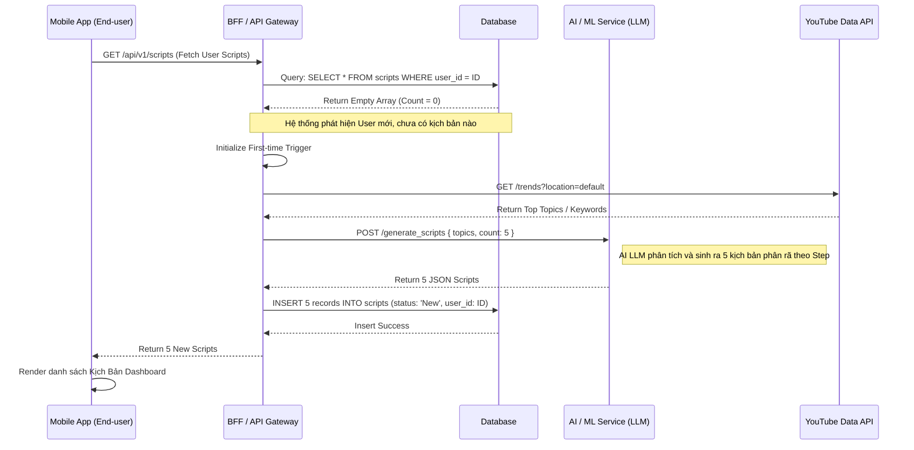
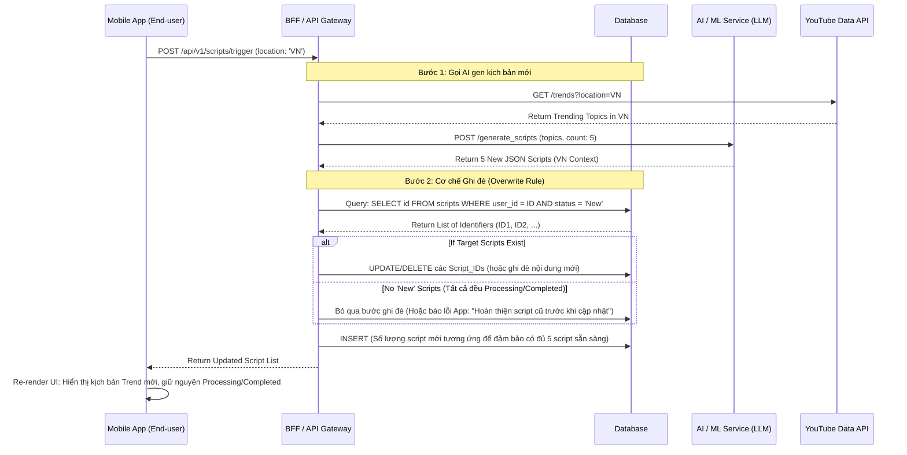

# Luồng Khởi Tạo Kịch Bản AI & Cơ Chế Ghi Đè (MVP V1)

Tài liệu này định nghĩa chi tiết thiết kế CSDL (Database Schema) tối thiểu và Sơ đồ Tuần tự (Sequence Flow) cho cơ chế tự động Trigger khởi tạo kịch bản AI ngay trên End-User Mobile App (Thay vì Admin trigger như thiết kế ban đầu).

## 1. Minimal Database Schema (ERD)

Mô hình dữ liệu tinh gọn tập trung vào việc lưu trữ trạng thái của Kịch Bản (`Scripts`) và thiết lập cấu hình.

- **Lưu ý Status của Script**: 
  - `New`: Kịch bản mới gen, User chưa thực hiện quay chụp gì. **ĐƯỢC PHÉP GHI ĐÈ**.
  - `Processing`: User đã bắt đầu bấm quay ở 1 vài Step bên trong. **KHÔNG ĐƯỢC GHI ĐÈ**.
  - `Completed`: User đã quay xong toàn bộ Step và Submit. **KHÔNG ĐƯỢC GHI ĐÈ**.

---

## 2. Sequence Flow: Khởi tạo tự động (First Login Auto-Trigger)

Luồng này diễn ra khi User đăng nhập thành công vào màn hình chính của Mobile App lần đầu tiên.

---

## 3. Sequence Flow: Làm mới thủ công / Ghi đè (Manual Update)

Luồng này diễn ra khi User chủ động nhấn nút "Cập nhật Kịch Bản" trên App để lấy Trend mới nhất khu vực hiện tại.

### Thuyết minh cơ chế:
1. **Kiểm tra trạng thái**: Backend luôn kiểm tra cột `status` trong `SCRIPTS`.
2. **Hard Replace / Soft Update**: Với các Scripts `status = 'New'`, hệ thống có thể hoàn toàn gạch bỏ (Hard Delete) và thay thế bằng Record mới từ LLM trả về, bảo đảm UI của User luôn có 5 Kịch bản tươi mới (Fresh Scripts) mỗi lần ấn Fetch.
3. Việc lấy location truyền trực tiếp từ App lên API giúp Gen kịch bản sát sườn với tệp Youtube Viewers mục tiêu của Kênh.
