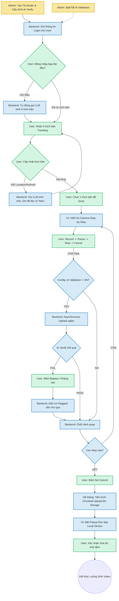
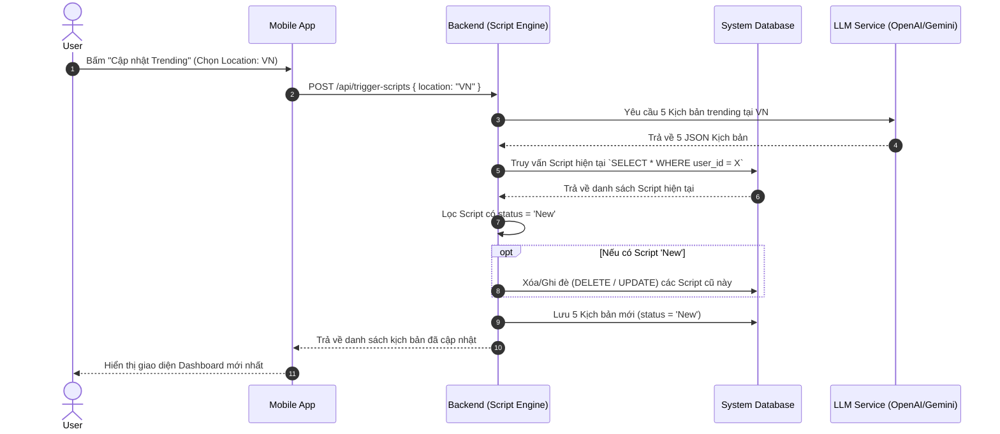
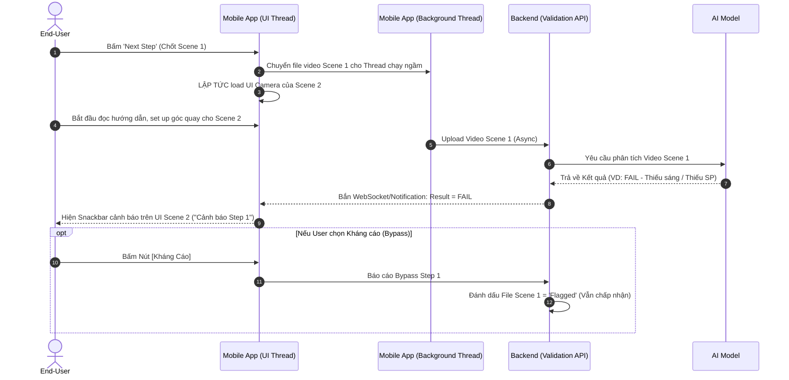

# Sơ đồ Quy trình Nghiệp vụ (Business Process & Workflow Diagrams) - MVP V1

Tài liệu này cung cấp các sơ đồ luồng (Workflow Diagrams) thể hiện rõ quy trình tương tác giữa Admin và End-User dựa trên các yêu cầu nghiệp vụ đã xác định ở BRD. Sơ đồ được vẽ bằng cú pháp Mermaid.

## 1. Quy trình Tổng thể (End-to-End Core Workflow)

Sơ đồ này mô tả toàn cảnh quá trình từ lúc Admin tạo tài khoản cho đến khi End-user hoàn thành một video kịch bản.

## 2. Luồng Khởi tạo Kịch bản & Cơ chế Ghi đè (Script Engine Generation)

## 3. Luồng Upload Bất đồng bộ và Xác thực AI (Asynchronous AI Validation)

