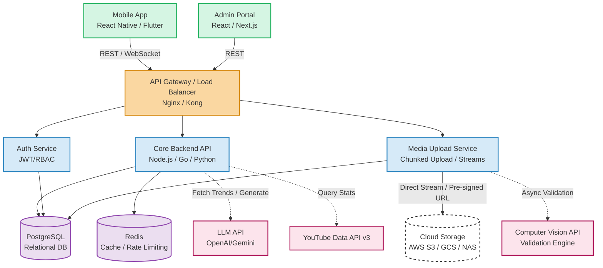

# Tổng quan Kiến trúc Hệ thống (Architecture Overview) - MVP V1

Tài liệu này mô tả kiến trúc tổng thể của hệ thống ShareWind MVP V1 dưới góc độ của System Architect, đảm bảo tính khả mở (scalability), hiệu năng cao cho việc upload video, và khả năng mở rộng AI trong tương lai.

## 1. Sơ đồ Kiến trúc Tổng thể (High-Level Architecture Diagram)

Kiến trúc theo mô hình Cấp phát API tập trung (API-Centric / Microservices-lite Architecture), tách biệt rõ ràng giữa Client (Mobile/Web), Gateway, Core Services, và Storage backend.

## 2. Nguyên lý Thiết kế Kiến trúc (Design Principles)

1. **Client-Server Separation:** API thiết kế dưới chuẩn RESTful, đảm bảo Admin Portal và Mobile App có thể phát triển độc lập (decoupled).
2. **Uploading Resilience (Upload Streaming):** Để khắc phục việc nghẽn cổ chai khi User up file lớn trên mạng di dộng yếu:
   - Sử dụng Chunked Upload: Cắt file 500MB thành các phần nhỏ (5MB/chunk) đẩy dần.
   - `UploadService` xử lý streaming trực tiếp lên S3/GCS thông qua cơ chế *Pre-signed URLs* an toàn để giảm tải băng thông cho máy chủ chính.
3. **Asynchronous Processing (Xử lý Bất đồng bộ):**
   - Tương tác với AI (Vision xác thực, LLM sinh kịch bản) là những tác vụ tốn thời gian. Backend API không dùng Request đồng bộ ghim connection.
   - Luồng Validation sẽ bắn Job vào Queue (RabbitMQ / Redis Queue). API trả về `202 Accepted` ngay lập tức. Sau khi xử lý xong AI chạy ngầm, bắn Notification/WebSocket xuống App.
4. **Data Isolation (Bảo vệ dữ liệu người dùng):** File cấu hình Cloud Storage (Access keys, Secrets) được lưu ở Database đã mã hóa ở tầng ứng dụng (AES-256) và thiết kế quyền chỉ cấp token temporary cho đúng User đó upload.

## 3. Lựa chọn Công nghệ (Technology Stack)

| Lớp (Layer) | Technology Stack Đề xuất (Phase 1) | Lý do Lựa chọn MVP |
| :--- | :--- | :--- |
| **Mobile App** | React Native (Expo) hoặc Flutter | Viết mã một lần chạy đa nền tảng (iOS, Android), hỗ trợ tốt module camera và background upload network. |
| **Web Admin** | React.js (Next.js) + TailwindCSS | Phát triển Frontend nhanh, component hóa (DataTable, Biểu đồ). |
| **Backend API** | Node.js (Express/NestJS) hoặc Python (FastAPI) | Tính phi đồng bộ I/O tốt của Node.js, hoặc sức mạnh xử lý AI của Python. Hệ sinh thái thư viện mạnh. |
| **Database** | PostgreSQL | RDBMS mạnh mẽ, ACID, phù hợp để tracking trạng thái các kịch bản chặt chẽ. Hỗ trợ JSONB ngon nếu Metadata linh hoạt. |
| **Caching/Queue** | Redis | Caching tốc độ nhanh, Rate limit và làm Message queue nhẹ thay thế RabbitMQ/Kafka ở MVP. |
| **Storage** | AWS S3 (hoặc Google Cloud Storage, NAS) | Rẻ, chuẩn công nghiệp, hỗ trợ Pre-signed URL. |

## 4. Xử lý Vòng đời (Lifecycle) Của Một Đoạn Video

1. **Quay phim (Mobile):** User quay video $\rightarrow$ Ghi file vào bộ nhớ thiết bị (Local Device).
2. **Bắt đầu tải (Mobile to Cloud):** App gọi API để xin 1 URL upload động (Pre-signed URL).
3. **Upload Trực tiếp (Cloud):** App đẩy file trực tiếp lên Storage thông qua URL này (không làm sập server Backend).
4. **Báo cáo (Mobile to Backend):** Khi Cloud báo Up xong 100%, App gọi API Backend `POST /verify` báo file đã nằm trên Cloud.
5. **Validation (Backend to AI):** Backend đẩy một Job vào Queue gọi AI (Computer Vision) tải file trên Cloud xuống phân tích.
6. **Kết quả (Backend to Mobile):** AI báo xong, Backend Update DB và gửi Webhook/Socket cho App.
